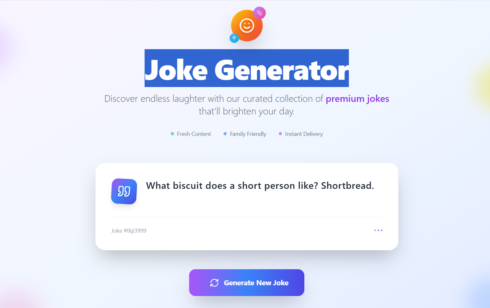

# Joke Generator App 🤣

A fun and simple **Joke Generator App** built using **React + Vite**. It fetches random jokes from a public API and displays them with a clean and modern UI.

## 🌐 Live Preview

Check out the live version here:  
🔗 [Joke Generator App](https://joke-generator-lake.vercel.app/)

## 🛠️ Features

- Generates random jokes instantly
- Responsive and clean user interface
- Built with React and Vite
- Minimal and modern design
- Uses a public joke API

## 🚀 Tech Stack

- React
- Vite
- CSS (custom styling)
- Public Joke API

## 📸 Screenshots

| Home Page                          |
|-----------------------------------|
|  |


> 💡 Make sure to check out the screenshot image paths depending on your folder structure (place them in an `assets/` folder or update paths accordingly).

## 🔧 Setup & Run Locally

```bash
# Clone the repository
git clone https://github.com/bansivachhani/Joke-Generator.git

# Navigate into the project folder
cd joke-generator-app

# Install dependencies
npm install

# Start the development server
npm run dev
